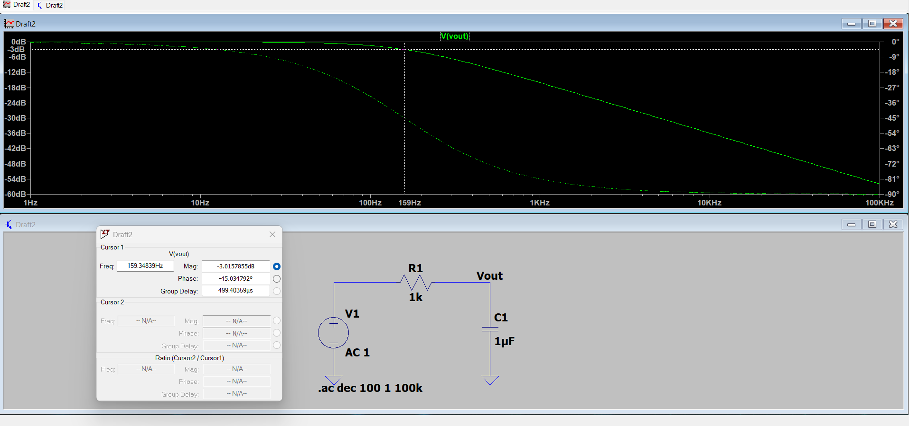
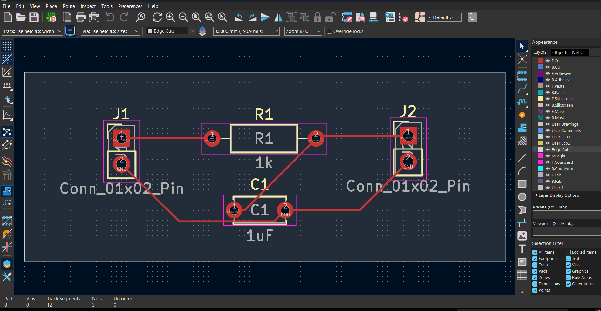
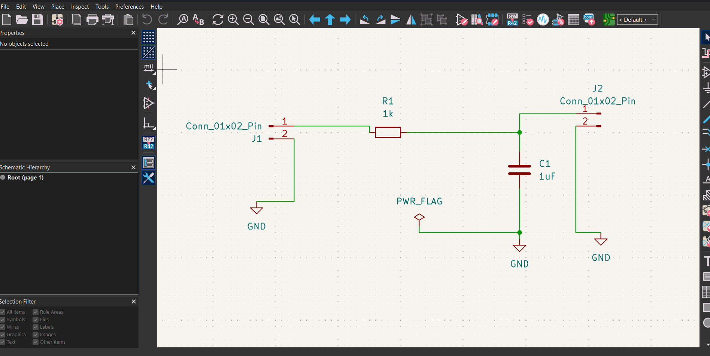

# Quantum Wave Packet Analysis with Signal Filtering & RC Circuit Design

## Origin

This started as a simple physics assignment.

The task was to simulate a quantum wave packet and demonstrate the Heisenberg uncertainty principle — show that a particle localized in position must be spread in momentum, and vice versa. I built the simulation in Python with interactive sliders for k₀ and σ, and that was supposed to be it.

But while working on it I noticed something. The Fourier Transform I was using to convert from position space to momentum space — that's the same FFT used in signal processing to decompose any signal into its frequency components. The wave packet wasn't just a quantum object. It was behaving exactly like a localized signal with a frequency spectrum.

That analogy opened everything up. If the momentum space representation is a frequency spectrum, then I could apply a filter to it. A low-pass filter would let certain frequency components through and block others. Inverse FFT would give back a cleaner signal in position space. The physics was different but the mathematics was identical.

From there I wanted to see how far I could take it. I modeled the filter on a real RC circuit (R=1kΩ, C=1µF, fc=159Hz), simulated it in LTspice to verify the −3dB point and phase response matched theory, then designed the PCB in KiCad and exported Gerber files — a board that could actually be manufactured.

What started as a one-week physics assignment became a complete cycle: **quantum simulation → Fourier analysis → signal filtering → analog circuit design → PCB layout → Gerber export.**

Every tool used in this project beyond Python was new to me. I learned LTspice and KiCad specifically to complete this the right way.

---

## The Core Idea

A quantum wave packet is a particle that isn't at one fixed location — it exists as a spread of many frequencies superimposed together. This is described by a wavefunction ψ(x).

When you apply a Fourier Transform to ψ(x), you move from position space to momentum space — and what you get is the frequency spectrum of that particle. This is identical in principle to how any real-world signal (audio, radio, seismic, gravitational wave strain data) can be decomposed into its frequency components using FFT.

Once you have the frequency spectrum, you can filter it. A low-pass filter lets low frequencies through and blocks high frequencies. Apply an inverse FFT and you get back a cleaner, smoother signal in position space — the high-frequency noise has been removed.

In one line: **take a signal → find what frequencies it contains → filter out the unwanted ones → get clean output.**

This is exactly the method used in gravitational wave detection at LIGO, where raw strain data is filtered to isolate the 35–350 Hz band where black hole merger signals live.

---

## What the Three Graphs Show

### Graph 1 — Position Space ψ(x)
The raw wave packet in position/space domain. The cyan wave is the wavefunction ψ(x) — it shows where the particle (or signal) is localized. The yellow curve is |ψ(x)|² — the probability density, showing where you're most likely to find the particle.

- **k₀ slider** controls the carrier frequency — how fast the wave oscillates
- **σ slider** controls the packet width — a wider packet means more localized in frequency (Heisenberg uncertainty principle in action)

### Graph 2 — Momentum / Frequency Space
This is the FFT of ψ(x). It shows which frequencies make up the wave packet.

- **Green region** = frequencies that PASS through the RC low-pass filter
- **Red region** = frequencies that are BLOCKED
- The white dotted line marks the cutoff frequency **fc = 159 Hz** (set by R=1kΩ, C=1µF)
- The **k_cutoff slider** lets you move the filter threshold in real time and see which frequencies pass or get blocked

### Graph 3 — Filtered Signal
The inverse FFT of the filtered spectrum. This is the cleaned output signal back in position space.

- Green = filtered signal (smooth, high-frequency components removed)
- Faint cyan = original signal for comparison

The filtered signal is visibly smoother — the sharp oscillations are gone because the high-frequency components that caused them were blocked by the filter.

---

## RC Low-Pass Filter

The filter used in the simulation is modeled on a real analog RC circuit:

| Component | Value |
|---|---|
| Resistor R1 | 1 kΩ |
| Capacitor C1 | 1 µF |
| Cutoff frequency fc | 1 / (2π × 1000 × 0.000001) ≈ **159 Hz** |

The filter transfer function is:

**H(f) = 1 / √(1 + (f/fc)²)**

At fc, the output voltage drops to 1/√2 of the input (−3dB). Above fc, the signal is progressively attenuated. Below fc, the signal passes through largely unchanged.

---

## LTspice Verification

The RC filter was independently simulated in LTspice using an AC sweep from 1Hz to 100kHz.



**Results confirm theory exactly:**
- At **159.34 Hz** → magnitude = **−3.01 dB** (theoretical: −3 dB ✓)
- Phase at fc = **−45°** (theoretical: −45° ✓)
- Roll-off above fc follows the expected −20 dB/decade slope

This validates that the filter modeled in the Python simulation matches real analog circuit behavior.

---

## PCB Design

The RC low-pass filter was taken from schematic to a manufacturable PCB layout in KiCad.





**Components:**
| Component | Value | Footprint |
|---|---|---|
| R1 | 1kΩ | R_Axial_DIN0207 |
| C1 | 1µF | C_Disc_D5.0mm |
| J1 | Input connector | Conn_01x02 |
| J2 | Output connector | Conn_01x02 |

**Files included:**
- `RC_LowPass_Filter.kicad_sch` — KiCad schematic
- `RC_LowPass_Filter.kicad_pcb` — KiCad PCB layout
- `gerbers.zip` — Gerber files ready for manufacturing (JLCPCB / PCBWay compatible)

DRC result: **0 errors, 0 warnings, 0 unconnected items.**

---

## Full Project Cycle

```
Python Simulation
      ↓
FFT → Frequency Analysis → RC Filter Applied → Inverse FFT
      ↓
LTspice AC Simulation
      ↓
Confirms fc = 159 Hz at −3dB, −45° phase
      ↓
KiCad Schematic → PCB Layout → Gerber Export
      ↓
Manufacturable board
```

---

## How to Run the Simulation

**Requirements:**
```
pip install numpy matplotlib
```

**Run:**
```
python quantum_wave_packet_filter.py
```

**Controls:**
- **k₀ slider** — carrier frequency of the wave packet
- **σ slider** — width of the wave packet (affects frequency spread)
- **k_cutoff slider** — move the filter cutoff threshold in real time

---

## Connection to Gravitational Wave Research

LIGO detects gravitational waves by measuring tiny distortions in spacetime using laser interferometry. The raw output is a strain signal sampled at 16,384 Hz — buried in noise across a wide frequency band.

To extract the gravitational wave signal, LIGO applies bandpass filters to isolate the 35–350 Hz band where compact binary merger signals appear. The filtered strain data is what produces the famous chirp signal.

This project demonstrates the foundational concept behind that pipeline: decompose a signal into its frequency content using Fourier analysis, apply a filter in the frequency domain, and reconstruct the cleaned signal. The physics differs in scale — but the signal processing method is the same.

---

## Tools Used

| Tool | Purpose |
|---|---|
| Python (NumPy, Matplotlib) | Wave packet simulation, FFT, filter application |
| LTspice | AC circuit simulation, Bode plot verification |
| KiCad | Schematic design, PCB layout, Gerber export |
